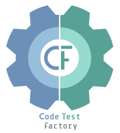

# Playwright-Learnings

This GitHub Repo is for learning and demonstration purposes.

<a href="https://github.com/codetestfactory-sohail/playwright-learnings">
  
</a>

## Project Overview

This project is a comprehensive demo and learning resource for Playwright automation using both TypeScript and Python. It is designed to help users understand and practice web automation concepts, best practices, and advanced techniques in a real-world project structure.

## Features

- Automated browser testing using Playwright
- TypeScript-based and Python-based test implementation
- Example of broken link detection
- Modern project structure for easy test management
- Sample test cases for real-world web applications
- HTML test reporting

## Getting Started

1. Clone the repository:
   ```
   git clone https://github.com/codetestfactory-sohail/playwright-learnings.git
   cd playwright-learnings
   ```
2. Install dependencies:
   ```
   npm install
   ```
3. Run the tests:
   ```
   npx playwright test
   ```
4. To run the Python demo script:
   ```
   pip install playwright
   playwright install
   python launch_site.py
   ```

## Requirements

- Node.js 18.x or higher
- npm 9.x or higher
- Python 3.8 or higher (for Python demo)

## Project Structure

- `tests/` - Contains Playwright test scripts in TypeScript
- `launch_site.py` - Python Playwright demo script
- `playwright.config.ts` - Playwright configuration file
- `playwright-report/` - HTML test reports
- `test-results/` - Raw test results

## License

This project is licensed under the MIT License - see the LICENSE file for details.

Authored by [Sohail](https://github.com/codetestfactory-sohail)

## About the Author

<a href="https://github.com/codetestfactory-sohail">
  
</a>

Sohail Mohammed - Initial work - [codetestfactory-sohail](https://github.com/codetestfactory-sohail)

Welcome to my corner of the internet! I've spent my career as a QA architect, and now I'm diving headfirst into the exciting field of AI. I share my learnings, thoughts, and discoveries.

Thank you for being a part of this journey!

Connect with me:

- [LinkedIn](https://www.linkedin.com/in/sohail056/)
- [Medium](https://medium.com/@sohail056)
- [DEV.to](https://dev.to/codetestfactory)
- [Twitter/X](https://x.com/codetestfactory)
- [Buy me a coffee](https://buymeacoffee.com/sohail056)

---
